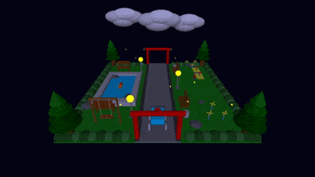

# Taman Bermain 3D (OpenGL FreeGLUT)

Simulasi **taman bermain 3D** menggunakan **OpenGL (FreeGLUT)**. Scene menampilkan beberapa objek (pohon, kolam, lampu, semak, gapura, jalan, kursi, ayunan, jungkat-jungkit, kincir angin, awan, mobil, ikan, dll) dengan beberapa animasi serta kontrol kamera dan cuaca melalui keyboard.

## Demo

  

## Fitur Utama
- **3 mode cuaca**: siang, sore, malam (mengubah background dan parameter lighting).
- **Kontrol kamera**: berpindah sudut pandang (depan/kiri/kanan/belakang) dan zoom in/out.
- **Animasi interaktif**:
  - Jungkat-jungkit (rotasi papan)
  - Ikan (translasi maju-mundur dan naik-turun)
  - Awan (skala)
  - Mobil (translasi maju-mundur)
  - Ayunan (rotasi ayunan)
  - Kincir angin (rotasi baling-baling)

## Kontrol Keyboard
### Cuaca
- `1` : Siang
- `2` : Sore
- `3` : Malam

### Kamera
- `s` : Kamera 1 (default)
- `a` : Kamera 2 (kiri)
- `d` : Kamera 3 (kanan)
- `w` : Kamera 4 (belakang)
- `=` : Zoom In (kamera mendekat)
- `-` : Zoom Out (kamera menjauh)

### Interaksi/Animasi Objek
- `p` : Gerakkan jungkat-jungkit (rotasi papan, otomatis balik arah di batas)
- `n` : Gerakkan ikan maju/mundur (akan berbalik arah saat mentok batas kolam)
- `u` : Ikan naik (hingga batas atas)
- `j` : Ikan turun (hingga dasar kolam)
- `o` : Skala awan (besar-kecil pada rentang tertentu)
- `m` : Gerakkan mobil (maju-mundur pada rentang tertentu)
- `k` : Ayunan (berayun, otomatis balik arah pada batas sudut)

### Kontributor Kelompok 1
1. `2406007` Sayyid Dzaky Farhan
2. `2406034` Rizal Septiazi
3. `2406018` Hilma Putri
4. `2406011` Assyifa Ramdani

**Mata Kuliah**: Grafika Komputer  
**Program Studi**: Teknik Informatika | Institut Teknologi Garut | 2026

